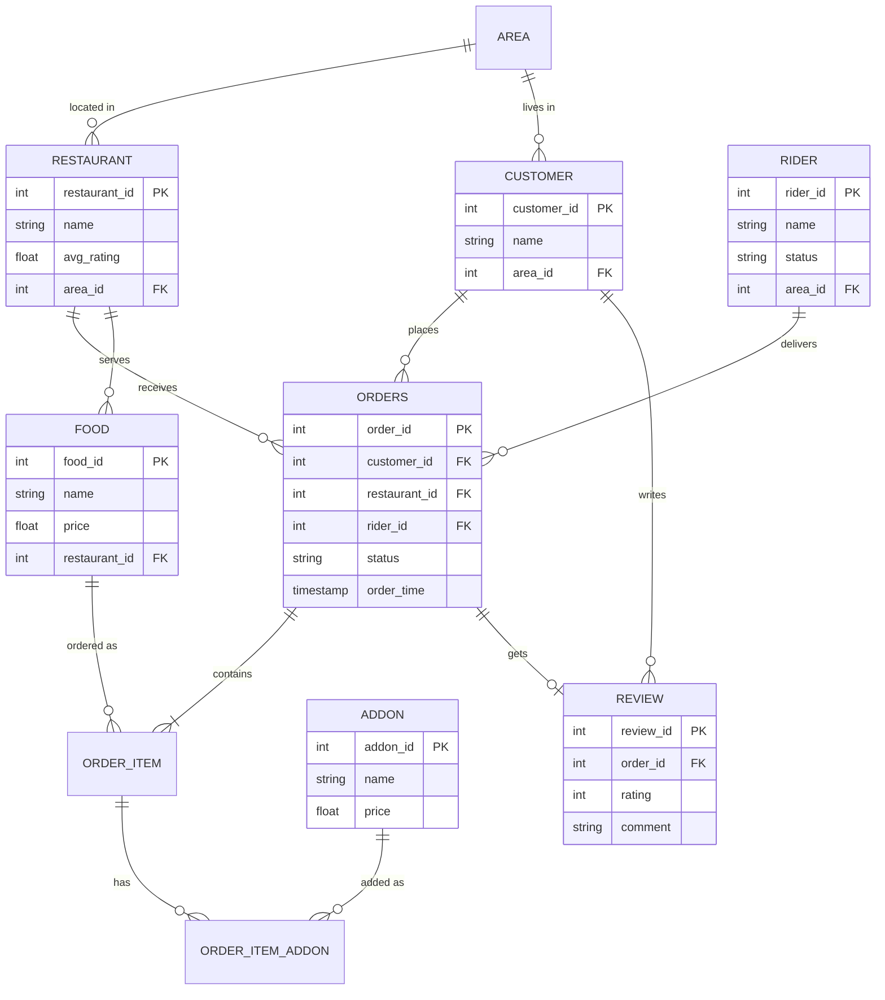

<!-- ===================== ANIMATED HEADER ===================== -->
<div align="center">


<a href="https://git.io/typing-svg">
  
</a>

<br/>

-orange?style=for-the-badge)


</div>


## 🎬 Demo Video

<div align="center">

[](https://youtu.be/CQVj2CLk2U0)

▶️ **[Click the thumbnail to watch on YouTube](https://youtu.be/CQVj2CLk2U0)**

</div>

---

## 📖 About

**Kheye Now** is a food-ordering and delivery system built as the term project for **CSE 216 – Database Management Systems Sessional** (Level-2, Term-1) at **Bangladesh University of Engineering and Technology (BUET)**.

The goal was to push as much application logic as possible **into the database itself**: a normalized schema, rich analytical SQL, and PL/SQL-style **triggers, functions and procedures** that automate the order lifecycle.

---

## ✨ Features at a Glance

| | Feature | How it's done |
|---|---|---|
| 📊 | **Top foods by location** | Aggregation + joins across orders, restaurants, areas |
| ⭐ | **Top rated restaurants** | Weighted average of customer reviews |
| 🛵 | **Top rides / riders** | Delivery counts, ratings, and on-time stats |
| 🧂 | **Top add-ons per food** | Order-item ↔ add-on frequency analysis |
| 🤖 | **Dynamic rider assignment** | `AFTER INSERT` trigger on orders |
| 🔄 | **Auto restaurant rating update** | Trigger on review insert/update |
| 💬 | **Review request after delivery** | Trigger on order status → `DELIVERED` |

---

## 🔁 Order Lifecycle (powered by triggers)

```mermaid
flowchart LR
    A([🧑 Customer places order]) --> B{{⚡ Trigger:<br/>assign_rider}}
    B -->|nearest free rider| C[🛵 Rider assigned]
    C --> D[🍳 Restaurant prepares]
    D --> E[📦 Out for delivery]
    E --> F([✅ Status = DELIVERED])
    F --> G{{⚡ Trigger:<br/>request_review}}
    G --> H[💬 Customer asked for review]
    H --> I{{⚡ Trigger:<br/>update_restaurant_rating}}
    I --> J([⭐ Restaurant rating refreshed])

    style B fill:#ff6b35,color:#fff
    style G fill:#ff6b35,color:#fff
    style I fill:#ff6b35,color:#fff
```



---

## 🗂️ Database Schema

> ⚠️ Replace the entities below with the exact tables from your final schema.



---

## 📊 Analytics Queries

<details>
<summary><b>🍛 Top foods ordered in a location</b></summary>

```sql
SELECT f.name AS food, a.area_name, COUNT(*) AS times_ordered
FROM   orders o
JOIN   order_item oi ON oi.order_id = o.order_id
JOIN   food f        ON f.food_id   = oi.food_id
JOIN   customer c    ON c.customer_id = o.customer_id
JOIN   area a        ON a.area_id   = c.area_id
WHERE  a.area_name = :area
GROUP  BY f.name, a.area_name
ORDER  BY times_ordered DESC
FETCH  FIRST 10 ROWS ONLY;
```
</details>

<details>
<summary><b>⭐ Top rated restaurants</b></summary>

```sql
SELECT r.name, ROUND(AVG(rv.rating), 2) AS avg_rating, COUNT(rv.review_id) AS total_reviews
FROM   restaurant r
JOIN   orders o   ON o.restaurant_id = r.restaurant_id
JOIN   review rv  ON rv.order_id = o.order_id
GROUP  BY r.name
HAVING COUNT(rv.review_id) >= 5
ORDER  BY avg_rating DESC, total_reviews DESC
FETCH  FIRST 10 ROWS ONLY;
```
</details>

<details>
<summary><b>🛵 Top riders (rides)</b></summary>

```sql
SELECT rd.name, COUNT(*) AS deliveries
FROM   orders o
JOIN   rider rd ON rd.rider_id = o.rider_id
WHERE  o.status = 'DELIVERED'
GROUP  BY rd.name
ORDER  BY deliveries DESC
FETCH  FIRST 10 ROWS ONLY;
```
</details>

<details>
<summary><b>🧂 Top add-ons of a food</b></summary>

```sql
SELECT ad.name AS addon, COUNT(*) AS times_added
FROM   order_item oi
JOIN   order_item_addon oia ON oia.order_item_id = oi.order_item_id
JOIN   addon ad             ON ad.addon_id = oia.addon_id
WHERE  oi.food_id = :food_id
GROUP  BY ad.name
ORDER  BY times_added DESC
FETCH  FIRST 5 ROWS ONLY;
```
</details>

> 💡 Add your own extras here: peak ordering hours, revenue per restaurant, average delivery time, repeat customers, etc.

---

## ⚡ Triggers, Functions & Procedures

> The snippets below are **illustrative** (Oracle PL/SQL style). Paste your actual implementation.

<details>
<summary><b>🛵 Trigger — Dynamic rider assignment</b></summary>

When a new order is inserted, the nearest available rider in the restaurant's area is assigned automatically and marked busy.

```sql
CREATE OR REPLACE TRIGGER trg_assign_rider
BEFORE INSERT ON orders
FOR EACH ROW
DECLARE
    v_rider_id rider.rider_id%TYPE;
BEGIN
    SELECT rider_id INTO v_rider_id
    FROM (
        SELECT rd.rider_id
        FROM   rider rd
        JOIN   restaurant r ON r.area_id = rd.area_id
        WHERE  r.restaurant_id = :NEW.restaurant_id
          AND  rd.status = 'AVAILABLE'
        ORDER  BY rd.last_delivery_time ASC
    )
    WHERE ROWNUM = 1;

    :NEW.rider_id := v_rider_id;
    UPDATE rider SET status = 'BUSY' WHERE rider_id = v_rider_id;
EXCEPTION
    WHEN NO_DATA_FOUND THEN
        :NEW.rider_id := NULL;   -- picked up later by the pending-order procedure
END;
/
```
</details>

<details>
<summary><b>⭐ Trigger — Restaurant rating update</b></summary>

```sql
CREATE OR REPLACE TRIGGER trg_update_restaurant_rating
AFTER INSERT OR UPDATE OF rating ON review
FOR EACH ROW
DECLARE
    v_restaurant_id orders.restaurant_id%TYPE;
BEGIN
    SELECT restaurant_id INTO v_restaurant_id
    FROM   orders WHERE order_id = :NEW.order_id;

    UPDATE restaurant r
    SET    avg_rating = (SELECT AVG(rv.rating)
                         FROM   review rv
                         JOIN   orders o ON o.order_id = rv.order_id
                         WHERE  o.restaurant_id = v_restaurant_id)
    WHERE  r.restaurant_id = v_restaurant_id;
END;
/
```
</details>

<details>
<summary><b>💬 Trigger — Ask for review after delivery</b></summary>

```sql
CREATE OR REPLACE TRIGGER trg_request_review
AFTER UPDATE OF status ON orders
FOR EACH ROW
WHEN (NEW.status = 'DELIVERED' AND OLD.status <> 'DELIVERED')
BEGIN
    INSERT INTO notification (customer_id, order_id, message, created_at)
    VALUES (:NEW.customer_id, :NEW.order_id,
            'How was your meal? Please rate your order!', SYSTIMESTAMP);

    UPDATE rider SET status = 'AVAILABLE' WHERE rider_id = :NEW.rider_id;
END;
/
```
</details>

<details>
<summary><b>🧮 Functions & Procedures</b></summary>

List your own here, for example:

| Name | Type | Purpose |
|---|---|---|
| `get_order_total(order_id)` | Function | Computes food + add-ons + delivery fee |
| `get_restaurant_rating(id)` | Function | Returns current average rating |
| `place_order(...)` | Procedure | Creates an order and its items atomically |
| `assign_pending_orders` | Procedure | Retries orders that had no free rider |
</details>

---

## 🧰 Tech Stack

<div align="center">


</div>

> Swap or add badges for whatever you used (Oracle, PostgreSQL, Node.js, Java, Python, etc.).

---

## 📁 Repository Structure

```text
kheye-now/
├── schema/
│   ├── 01_create_tables.sql
│   └── 02_constraints.sql
├── data/
│   └── seed_data.sql
├── queries/
│   └── analytics.sql
├── triggers/
│   ├── assign_rider.sql
│   ├── update_rating.sql
│   └── request_review.sql
├── functions/
├── procedures/
├── docs/
│   └── report.pdf
└── README.md
```

---

## 🚀 Getting Started

```bash
# 1. Clone
git clone https://github.com/<your-username>/kheye-now.git
cd kheye-now

# 2. Create schema, then load data
#    (run these in your SQL client)
@schema/01_create_tables.sql
@schema/02_constraints.sql
@data/seed_data.sql

# 3. Compile triggers, functions, procedures
@triggers/assign_rider.sql
@triggers/update_rating.sql
@triggers/request_review.sql

# 4. Run analytics
@queries/analytics.sql
```

---

## 👥 Team

| Name | Student ID | GitHub |
|---|---|---|
| MD. NAJMUS SAKIB | 2405085 | [@najmussakib1](https://github.com/najmussakib1) |

**Course:** CSE 216 – Database Sessional
**Level/Term:** L-2 T-1
**Institution:** Bangladesh University of Engineering and Technology (BUET)
**Instructors:** SUKARNA BARUA, Associate Professor, CSE, BUET

---

<div align="center">

⭐ **If you found this useful, consider starring the repo!** ⭐


</div>
